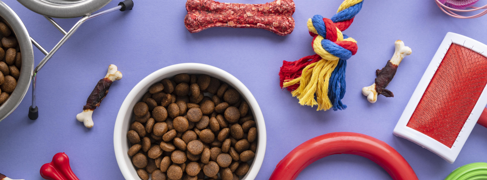

# sql-data-cleaning-pet_supplies
Data cleaning of a pet supplies dataset. Used SQL to complete the project.

# Context
PetMind is a retailer of products for pets. They are based in the United States.
PetMind sells products that are a mix of luxury items and everyday items. Luxury items include toys. Everyday items include food.
The company wants to increase sales by selling more products for some animals repeatedly.
They have been testing this approach for the last year.
They now want a report on how repeat purchases impact sales.

# Data
The data is available in the file pet_supplies.csv

The dataset contains the sales records in the stores last year.
| ColumnName     | Criteria                                                                                                                                                         |
| -------------  |-------------|
| **product_id**    | Nominal. The unique identifier of the product. Missing values are not possible due to the database structure. |
| **category**       | Nominal. The category of the product, one of 6 values (Housing, Food, Toys, Equipment, Medicine, Accessory). Missing values should be replaced with “Unknown”.   |
| **animal**       | Nominal. The type of animal the product is for. One of Dog, Cat, Fish, Bird. Missing values should be replaced with “Unknown”. |
| **size**         | Ordinal. The size of animal the product is for. Small, Medium, Large. Missing values should be replaced with “Unknown”.|
| **price**         | Continuous. The price the product is sold at. Can be any positive value, round to 2 decimal places. Missing values should be replaced with the overall median price.|
| **sales**         | Continuous. The value of all sales of the product in the last year. This can be any positive value, rounded to 2 decimal places. Missing values should be replaced with the overall median sales.|
| **rating**         | Discrete. Customer rating of the product from 1 to 10. Missing values should be replaced with 0.|
| **repeat_purchase**| Nominal. Whether customers repeatedly buy the product (1) or not (0). Missing values should be removed. |

# Task 1
From taking a quick look at the data, you are pretty certain it isn't quite as it should be. You need to make sure all of the data is clean before you start your analysis. The table below shows what the data should look like.
Write a query to return a table that matches the description provided.
Do not update the original table.

# Task 2
You want to show whether sales are higher for repeat purchases for different animals. You also want to give a range for the sales.
Write a query to return the animal, repeat_purchase indicator and the avg_sales, along with the min_sales and max_sales. All values should be rounded to whole numbers.

# Task 3
The management team want to focus on efforts in the next year on the most popular pets - cats and dogs - for products that are bought repeatedly.
Write a query to return the product_id, sales and rating for the relevant products.
You should use the original pet_supplies data for this task.

